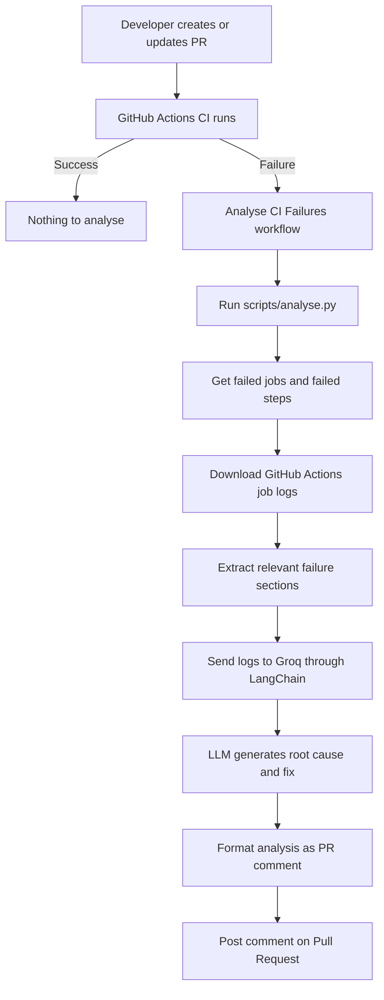

### CI/CD Pipeline Failure Analysis with AI 📜 🧠

CI/CD pipelines are great when they work

But when they fail, the usual experience is:

- Open GitHub Actions
- Find the failed job
- Scroll through a huge amount of logs
- Search for the actual error
- Try to understand the root cause
- Figure out what should be fixed

For small failures this is fine. For large pipelines, it can take a lot of time

So I built this project to make that process a little easier

### Want to see the results first?

👉 Click here and see the AI analysis of pipeline failure **LIVE** : https://github.com/neelkumar01/ci-cd-pipeline-failure-analysis-with-AI/pull/1#issuecomment-5278046628

### How it works?

Whenever a monitored GitHub Actions workflow fails, the project automatically:

1. Detects the failed workflow
2. Finds the failed jobs and steps
3. Downloads the actual job logs
4. Extracts the most useful error-related sections
5. Sends those logs to an LLM using LangChain + Groq
6. Asks the model to identify the root cause
7. Posts the analysis directly as a comment on the related Pull Request

### Architectur



### Secrets

The Groq API key is stored using GitHub Actions Secrets, not inside the repository

The workflow uses:

👉 GROQ_API_KEY

GitHub also provides its own:

👉 GITHUB_TOKEN

during the workflow run

> [!NOTE]
> The analyzer workflow has permissions to read Actions data and post comments on Pull Requests

### Problems I faced while building it

- The workflow worked but the AI analysis was completely wrong

During the first successful end to end test, the intentional failure was simply: `exit 1` but the AI reported an Azure Storage authentication problem.

The model was actually receiving the wrong content. Instead of the real GitHub job logs, the log download request had returned an authentication error from the temporary storage URL used by GitHub so the AI correctly analyzed the wrong input

- GitHub job logs use a redirect

The GitHub job logs endpoint returns a temporary download URL. My first implementation handled this incorrectly and resulted in authentication errors such as: `AuthenticationFailed`. The log fetching logic was changed so the analyzer retrieves the actual job log correctly before sending anything to the LLM

- The AI needed stronger instructions

The initial prompt was very simple: `Analyze the CI failure and find the root cause`. That leaves too much room for interpretation. The prompt was improved which made the diagnosis much more reliable

### Final Test Result 😃

⭐️ Live results here: https://github.com/neelkumar01/CI-pipeline-failure-analysis-with-AI/pull/1#issuecomment-5278046628

```
CI Failure Analysis 👀
Automatically analysed by the CI Failure Analyser

❌ test
Diagnosis
1. Root Cause
The pipeline failed because the step “Intentional Test Failure” explicitly runs the command exit 1, which terminates the shell with a non‑zero exit code. This intentional exit is the direct reason the job ends with exit code 1.

2. Evidence from logs

##[group]Run exit 1 – the step title shows the command that will be executed.
�[36;1mexit 1�[0m – the exact command that is run.
shell: /usr/bin/bash -e {0} – Bash is invoked with -e, so any non‑zero status aborts the step.
##[error]Process completed with exit code 1. – the step (and thus the job) ends with the expected failure code.
No other errors or warnings precede this; the failure is intentional.

3. Recommended Fix

Remove the exit 1 command if the step is no longer needed.
If the step is meant to act as a placeholder, replace it with a no‑op such as echo "placeholder" or true.
If you need a conditional failure, guard it with a condition that only triggers when a real problem is detected, e.g.:
- name: Intentional Test Failure
  if: ${{ failure() }}   # or any custom condition
  run: exit 1
4. Prevention

Audit pipeline scripts before merging to ensure no stray exit 1 (or other non‑zero exits) remain as debugging artifacts.
Use a linting/validation step (e.g., actionlint or custom CI lint) that flags steps containing bare exit commands without context.
Document the purpose of any intentional failure steps and protect them with clear conditions or comments, so future maintainers understand they are not accidental.
Analysis powered by Groq AI. Always verify before applying fixes
```
